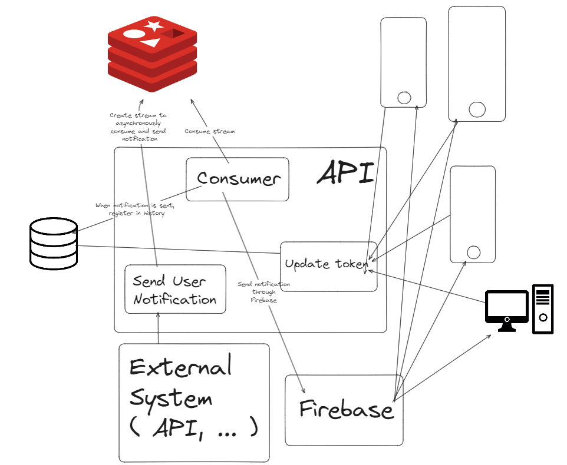

# Rusty Push Notifier

## Requirements
- cargo 1.80
- rust 1.80
- docker
- Bruno ( https://www.usebruno.com/ )

## Installation

To start database & redis, run following command :

```bash
docker compose up -d
```

Add your Google service account credentials in `./resources/google_service_account_credentials.json`

## Run

To run in watch mode : 
```bash
cargo watch -x run --clear
```

To simply run the app :
```bash
cargo run
```

To start the consumer :
```bash
cargo run --package command --bin command
# OR simply
cargo run # in command folder
```

## Api DOC

A swagger is delivered at `http://localhost:8080/swagger/`

## Bruno Example

To look on requests example, open Bruno app, and open folder `BrunoExample`.

## Things to improve project

- Implement RabbitMq / Kafka to consume messages and make choice between them and redis.
- The Code / Typing
- Add some unit / integration tests
- ...

## How it works
Could works too with RabbitMQ or Kafka.

